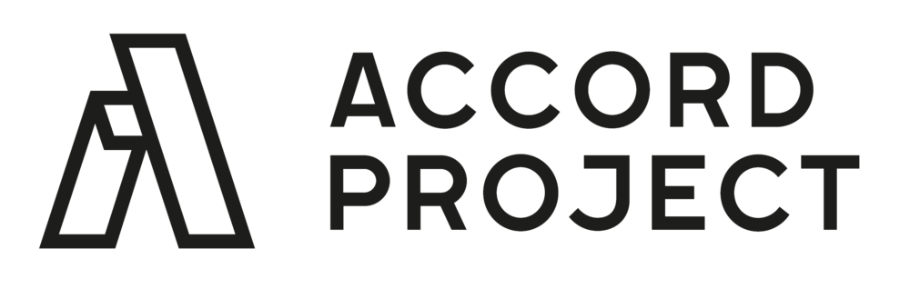

<p align="center">
  <a href="https://www.accordproject.org/projects/ergo">
    
  </a>
</p>

<p align="center">
     <a href="https://github.com/accordproject/ergo/actions/workflows/build.yml"></a>
  <a href="https://circleci.com/gh/accordproject/ergo"></a>
  <a href="https://coveralls.io/github/accordproject/ergo?branch=master"></a>
  <a href="./LICENSE"></a>
  <a href="https://www.npmjs.com/package/@accordproject/ergo-cli"></a>
  <a href="https://badge.fury.io/js/%40accordproject%2Fergo-cli"></a>
  <a href="https://discord.gg/Zm99SKhhtA/">
    
  </a>
</p>

## Introduction

This is the source code for the Ergo compiler. Ergo is the [Accord Project][apmain] language for Smart Legal Contracts.

The Ergo compiler is distributed as an [npm package][npmpkg]. 

The Ergo compiler is written using the [Coq][coq] proof assistant, with parsing and support code written in [OCaml][OCaml]. It makes extensive use of the [Q*cert compiler][Qcert] for code generation and type checking.

Both the Ergo language and its compiler are in early development phase. If you would like to build from source or to contribute, consult the [DEVELOPERS][developers] file.

## Try Ergo online

If you want to take a peek at Ergo without installing anything, check out the interactive [REPL][REPL] (read-eval-print-loop) for Ergo stand-alone, or the [Accord Project Template Studio][studio] which illustrates Ergo in Accord Project templates.

## Documentation

The most recent Ergo documentation is in the [Ergo Language Guide][docergo].

## Structure of the Code Repository

Top level repository (ergo), with sub packages. Each sub-package is published as an independent npm module using `lerna`:
* [ergo-cli](https://github.com/accordproject/ergo/tree/master/packages/ergo-cli) : Command line interface for the Ergo compiler
* [ergo-compiler](https://github.com/accordproject/ergo/tree/master/packages/ergo-compiler) : Core classes for the Ergo compiler
* [ergo-engine](https://github.com/accordproject/ergo/tree/master/packages/ergo-engine) : A Node.js VM based execution engine for Ergo
* [ergo-test](https://github.com/accordproject/ergo/tree/master/packages/ergo-test) : Cucumber based testing for Ergo

## Installation

The easiest way to install Ergo is as a [Node.js][nodejs] package. Once you have Node.js installed on your machine, you can get the Ergo compiler and command-line using the Node.js package manager by typing the following in a terminal:

```sh
$ npm install -g @accordproject/ergo-cli
```

This will install the Ergo command-line (`ergo`) and Read-Eval-Print-Loop (`ergotop`). Those will allow you to create, test and compile Ergo contracts. You can check your installed version by typing the following in a terminal:

```sh
$ ergo --version
```

Or to get command line help:

```sh
$ ergo --help
ergo <command>

Commands:
  ergo draft       create a contract text from data
  ergo trigger     send a request to the contract
  ergo invoke      invoke a clause of the contract
  ergo initialize  initialize the state for a contract
  ergo compile     compile a contract

Options:
  --help         Show help                                             [boolean]
  --version      Show version number                                   [boolean]
  --verbose, -v                                                 [default: false]
```

### Create contract text

To create a contract text from a contract:

```sh
$ ergo draft --template ./tests/volumediscount --data ./tests/volumediscount/data.json
```

### Initialize a contract

To obtain the initial state of the contract:

```sh
$ ergo initialize --template ./tests/volumediscount --data ./tests/volumediscount/data.json
06:40:29 - info:
```

### Send a request to a contract

To send a request to a contract:

```sh
$ ergo trigger --template ./tests/volumediscount --data ./tests/volumediscount/data.json --request ./tests/volumediscount/request.json --state ./tests/volumediscount/state.json
06:40:01 - info:
{
  "clause": "orgXaccordprojectXvolumediscountXVolumeDiscount",
  "request": {
    "$class": "org.accordproject.volumediscount.VolumeDiscountRequest",
    "netAnnualChargeVolume": 10.4
  },
  "response": {
    "$class": "org.accordproject.volumediscount.VolumeDiscountResponse",
    "discountRate": 2.8,
    "transactionId": "13fa7cb6-03fc-4fd8-8e12-9a85ac8d5eb7",
    "timestamp": "2019-10-12T23:56:33.688Z"
  },
  "state": {
    "$class": "org.accordproject.cicero.contract.AccordContractState",
    "stateId": "1"
  },
  "emit": []
}
```

### Invoke a clause

To invoke a specific clause of the contract:

```sh
$ ergo invoke --template ./tests/volumediscount --clauseName volumediscount --data ./tests/volumediscount/data.json --params ./tests/volumediscount/params.json --state ./tests/volumediscount/state.json
```

### Compile a contract

To compile your first Ergo contract to JavaScript:

```sh
$ ergo compile ./tests/volumediscount/model/model.cto ./tests/volumediscount/logic/logic.ergo
Processing file: ./tests/volumediscount/logic.ergo -- compiled to: ./tests/volumediscount/logic.js
```

By default, Ergo compiles to JavaScript for execution. You can inspect
the compiled JavaScript code in `./tests/volumediscount/logic.js`


[npmpkg]: https://www.npmjs.com/package/@accordproject/ergo-cli
[coq]: https://coq.inria.fr
[OCaml]: https://ocaml.org
[Qcert]: https://querycert.github.io
[REPL]: https://ergorepl.netlify.com
[studio]: https://studio.accordproject.org
[nodejs]: https://nodejs.org/

---

<p align="center">
  <a href="https://www.accordproject.org/">
    
  </a>
</p>

<p align="center">
  <a href="./LICENSE">
    
  </a>
  <a href="https://discord.gg/Zm99SKhhtA">
    
  </a>
</p>

Accord Project is an open source, non-profit, initiative working to transform contract management and contract automation by digitizing contracts. Accord Project operates under the umbrella of the [Linux Foundation][linuxfound]. The technical charter for the Accord Project can be found [here][charter].

## Learn More About Accord Project

### [Overview][apmain]

### [Documentation][apdoc]

## Contributing

The Accord Project technology is being developed as open source. All the software packages are being actively maintained on GitHub and we encourage organizations and individuals to contribute requirements, documentation, issues, new templates, and code.

Find out what’s coming on our [blog][apblog].

Join the Accord Project Technology Working Group [Discord Server][apdiscord] to get involved!

For code contributions, read our [CONTRIBUTING guide][contributing] and information for [DEVELOPERS][developers].

### README Badge

Using Accord Project? Add a README badge to let everyone know: [](https://www.accordproject.org/)

```
[](https://www.accordproject.org/)
```

## License <a name="license"></a>

Accord Project source code files are made available under the [Apache License, Version 2.0][apache].
Accord Project documentation files are made available under the [Creative Commons Attribution 4.0 International License][creativecommons] (CC-BY-4.0).

Copyright 2018-2019 Clause, Inc. All trademarks are the property of their respective owners. See [LF Projects Trademark Policy](https://lfprojects.org/policies/trademark-policy/).

[linuxfound]: https://www.linuxfoundation.org
[charter]: https://github.com/accordproject/governance/blob/master/accord-project-technical-charter.md
[apmain]: https://accordproject.org/ 
[apblog]: https://medium.com/@accordhq
[apdoc]: https://docs.accordproject.org/
[apdiscord]: https://discord.gg/Zm99SKhhtA 

[contributing]: https://github.com/accordproject/ergo/blob/master/CONTRIBUTING.md
[developers]: https://github.com/accordproject/ergo/blob/master/DEVELOPERS.md

[apache]: https://github.com/accordproject/ergo/blob/master/LICENSE
[creativecommons]: http://creativecommons.org/licenses/by/4.0/