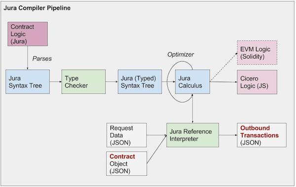

# What is Jura?

Jura is a prototype for a domain specific language (DSL) aimed at
capturing the execution logic of _legal_ contracts. It is a work in
progress. Here are some thoughts and notes on requirements and on the
initial design.

## Overview

Jura is a domain specific language designed to capture the execution logic of _legal_ contracts. Among some of the goals for the language are:
- to have contracts and clauses as first-class elements of the language
- to help legal-tech developer to quickly and safely develop computable legal contracts
- to be modular, facilitating reuse of existing contract or clause logic
- to ensure safe execution: the language should prevent run-time errors and non-terminating logic
- to be blockchain neutral: the same contract logic can be deployed either on and off chain and to a variety of distributed ledger technologies
- to be formally specified: the meaning of contracts should be well defined so it can be verified, and preserved during execution
- to be consistent with the AccordProject template specification

## Design choices

To achieve those goals the design of Jura is based on the following principles:
- It manipulates concepts and transations from CTO models as defined in the AccordProject specification
- Contracts have a class-like structure with clauses as methods
- It borrows from strongly-typed functional programming language: clauses have a well-defined signature (input and output), they are functions without side effects
- Clauses are written in an expression language with limited expressiveness (it allows conditional and bounded iteration).
- Part of the compiler is written in Coq as a stepping stone for formal specification and verification.

## Compiler architecture

The initial architecture for the Jura compiler is as follows:

## Language design

The language syntax and design are preliminary, but a few notes can be
found in [Language.md](Language.md).

## Caveats

- The current implementation only supports the JavaScript backend
- There is no type checker yet.

