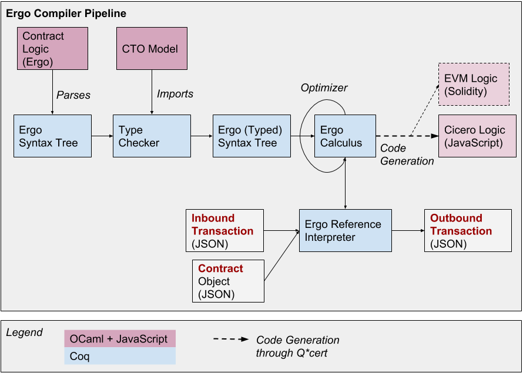

## Architecture

The initial architecture for the Ergo compiler is as follows:

## Verification

A large part of the source code for the Ergo compiler is based on a
mechanization in Coq from which part of the compiler is extracted. A
browsable version of the Coq code (generated using
[coq2html](https://github.com/xavierleroy/coq2html)) is available in
[specification](http://ergo.accordproject.org/Specification.html).

Ultimately, one of our goals is to provide a full formal semantics for
Ergo in Coq, and prove correct as much of the compilation pipeline as
possible.

