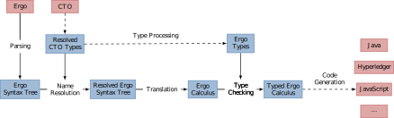
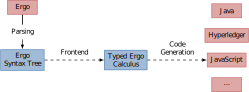

The Coq source serves a dual purpose: as Ergo's formal semantics and as part of its implementation through extraction. Here are some entry points to the code.

## Frontend architecture

## Code generation

## Intermediate representations

- Ergo: [Ast](assets/specification/ErgoSpec.Ergo.Lang.Ergo.html)
- Ergo Calculus: [Ast](assets/specification/ErgoSpec.ErgoCalculus.Lang.ErgoCalculus.html)

## Translation passes

- Ergo to Ergo Calculus: [Translation](assets/specification/ErgoSpec.Translation.ErgotoErgoCalculus.html)

