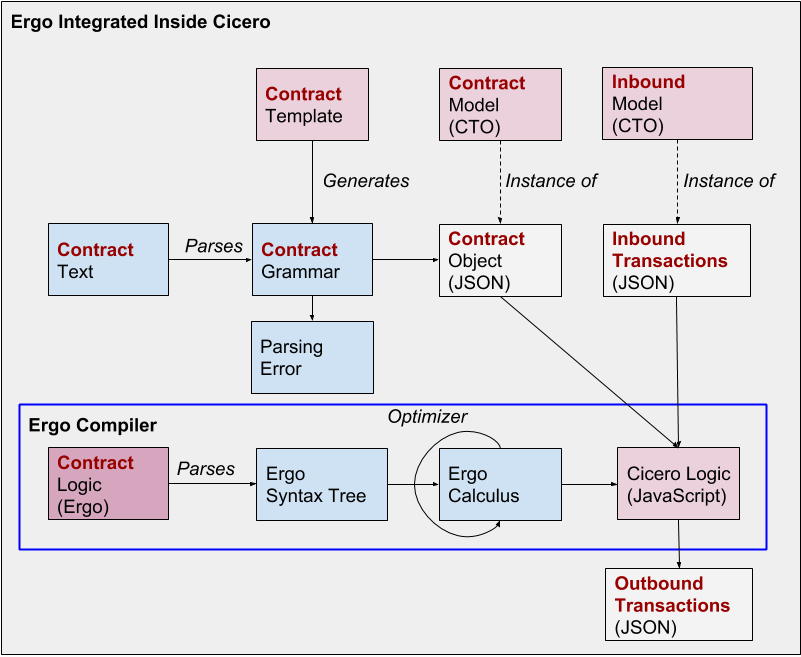

Overview
========

Ergo is a prototype for a domain specific language (DSL) aimed at
capturing the execution logic of *legal* contracts. It is a work in
progress. Here are some thoughts and notes on requirements and on the
initial design.

What is Ergo?
-------------

Ergo is a domain specific language designed to capture the execution
logic of *legal* contracts. Among some of the goals for the language
are: - to have contracts and clauses as first-class elements of the
language - to help legal-tech developer to quickly and safely develop
computable legal contracts - to be modular, facilitating reuse of
existing contract or clause logic - to ensure safe execution: the
language should prevent run-time errors and non-terminating logic - to
be blockchain neutral: the same contract logic can be deployed either on
and off chain and to a variety of distributed ledger technologies - to
be formally specified: the meaning of contracts should be well defined
so it can be verified, and preserved during execution - to be consistent
with the [Accord Protocol Template
Specification](https://docs.google.com/document/d/1UacA_r2KGcBA2D4voDgGE8jqid-Uh4Dt09AE-shBKR0)

Design choices
--------------

To achieve those goals the design of Ergo is based on the following
principles: - It can handle types (concepts, transations, etc) defined
with the [Hyperledger Composer Modeling
Language](https://hyperledger.github.io/composer/reference/cto_language.html)
(so called CTO models), as mandated by the Accord Prototype Template
Specification. - Contracts have a class-like structure with clauses akin
to methods - It borrows from strongly-typed functional programming
languages: clauses have a well-defined type signature (input and
output), they are functions without side effects - The compiler
guarantees error-free execution for well-typed Ergo programs - Clauses
and functions are written in an expression language with limited
expressiveness (it allows conditional and bounded iteration). - Most of
the compiler is written in Coq as a stepping stone for formal
specification and verification.

The Ergo Compiler
-----------------

### Architecture

The initial architecture for the Ergo compiler is as follows:

### Verification

A large part of the source code for the Ergo compiler is based on a
mechanization in Coq from which part of the compiler is extracted. A
browsable version of the Coq code (generated using
[coq2html](https://github.com/xavierleroy/coq2html)) is available in
[specification](https://accordproject.github.io/ergo/Specification.html).

Ultimately, one of our goals is to provide a full formal semantics for
Ergo in Coq, and prove correct as much of the compilation pipeline as
possible.

Relationship to the Accord Project
----------------------------------

One of the use for the Ergo compiler is as an embedded component
inside [Cicero](https://github.com/accordproject/cicero), which
implements the [Accord Protocol Template
Specification](https://docs.google.com/document/d/1UacA_r2KGcBA2D4voDgGE8jqid-Uh4Dt09AE-shBKR0).
The following diagram describe how this works:

Status
------

- The current implementation only supports the JavaScript backend for Cicero (and Hyperledger)
- CTO models are imported, but not used for type checking yet (but stay tuned!)

